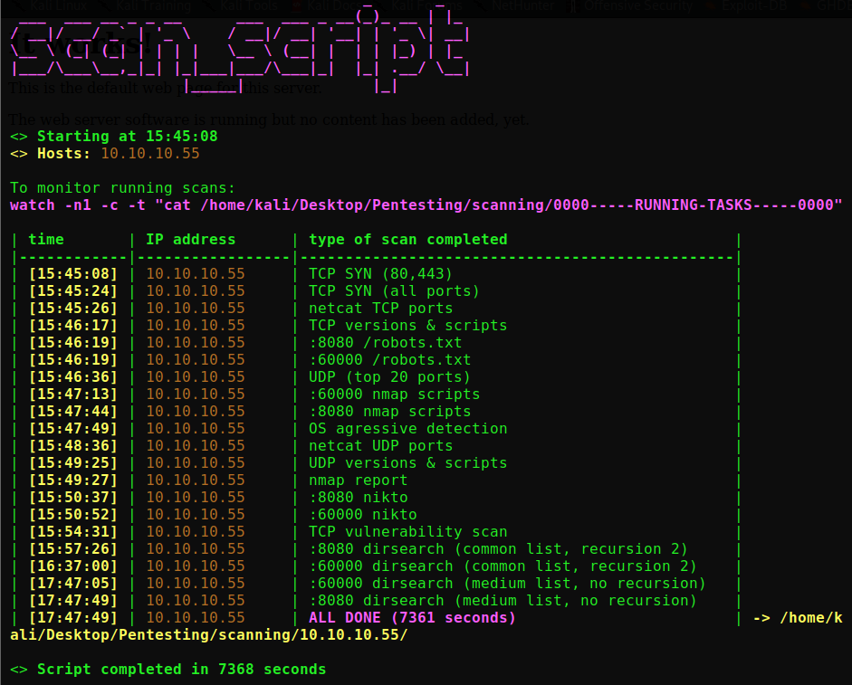

# Scan script

A bash script I used in OSCP to automate port scanning and basic enumeration

## Requirements
- nmap
- netcat
- enum4linux
- smbclient
- smbmap
- dirsearch (**put dirsearch folder in /home/kali/Desktop/**)
- gobuster (https://github.com/OJ/gobuster)
- nikto
- seclists (**sudo apt update && sudo apt install seclists**)

## Initialization
- make the script executable: **chmod +x scan_script**
- (don't forget to put dirsearch folder in /home/kali/Desktop/)

## Usage
- put your targets in hosts_list.txt (one per line; **I recommend no more than 4-5 targets** to avoid too much CPU load)
- in one terminal: **sudo ./scan_script hosts_list.txt**
- in another terminal & from the same directory: **watch -n1 -c -t "cat 0000-----RUNNING-TASKS-----0000"**
- before relaunching the script from the same directory, make sure that there are no folders named with targets IPs

## Commands run by the script
- nmap -sS -T4 -p- IP --reason -Pn -n
- nmap -sU -A -T4 IP --reason --top-ports=20 -Pn -n
- nmap -sTCV --version-all -T4 -p OPEN_TCP_PORTS IP -Pn -n
- nmap -sUCV --version-all -T4 -p OPEN_UDP_PORTS IP -Pn -n
- nmap -sT -sU -A --osscan-guess -T4 IP -p T:OPEN_TCP_PORTS,666,U:OPEN_UDP_PORTS -Pn -n
- nmap -sT --script +vuln -T4 -p OPEN_TCP_PORTS IP -Pn -n
- for all open TCP ports:
  - nc -nvvC IP PORT -w 60, and send random packets
- for all open UDP ports:
  - nc -nvvC -u IP PORT -w 60, and send random packets
- if port 139 or port 445 open:
  - enum4linux -v IP
  - smbclient -L\\ -N -I IP
- if port 445 open:
  - smbmap -u null -p "" -H IP -P 445
  - for each share IPC$, C$, Admin$^:
    - smbclient //IP/SHARE -N -p445 -q15 -c 'dir'
- if port 139 open:
  - smbmap -u null -p "" -H IP -P 139
  - for each share IPC$, C$, Admin$^:
    - smbclient //IP/SHARE -N -p139 -q15 -c 'dir'
- for each open http port:
  - dirsearch.py -u http://IP:PORT/ -e "txt,html,php,asp,aspx,jsp,bak,old,cgi,py,pl" -w /usr/share/seclists/Discovery/Web-Content/common.txt -r -t 10 -F -R 2 -f
  - dirsearch.py -u http://IP:PORT/ -e "txt,html,php,asp,aspx,jsp,bak,old,cgi,py,pl" -w /usr/share/dirbuster/wordlists/directory-list-2.3-medium.txt -t 10 -F -f
  - nikto -ask=no -h http://IP:PORT/
  - nmap -vv --reason -Pn -sV -p PORT IP --script="banner,(http* or ssl*) and not (brute or broadcast or dos or external or http-slowloris* or fuzzer)"
  - curl IP:port/robots.txt
- for each open https port:
  - gobuster dir -x "txt,html,php,asp,aspx,jsp,bak,old,cgi,py,pl" -r -k -u https://IP:PORT/ -z -q -t 10 -v -w /usr/share/seclists/Discovery/Web-Content/common.txt
  - gobuster dir -x "txt,html,php,asp,aspx,jsp,bak,old,cgi,py,pl" -r -k -u https://IP:PORT/ -z -q -t 10 -v -w /usr/share/dirbuster/wordlists/directory-list-2.3-medium.txt
  - nikto -ask=no -h https://IP:PORT/
  - nmap -vv --reason -Pn -sV -p PORT IP --script="banner,(http* or ssl*) and not (brute or broadcast or dos or external or http-slowloris* or fuzzer)"
  - curl IP:port/robots.txt
